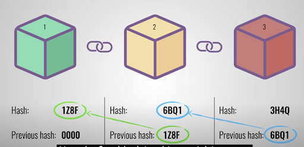
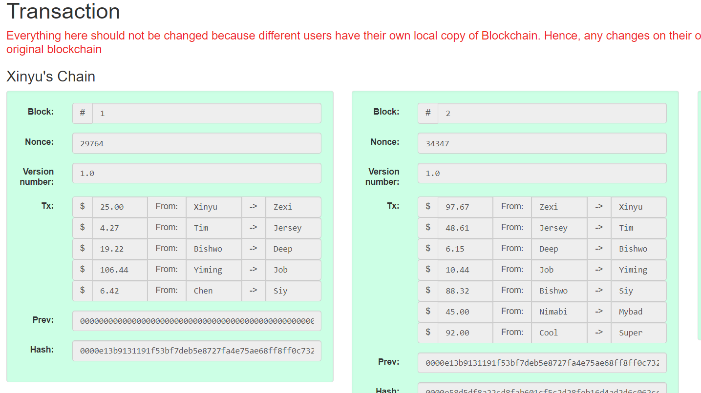
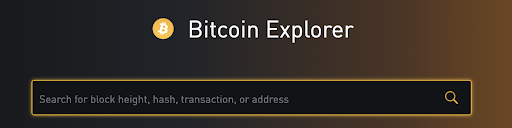
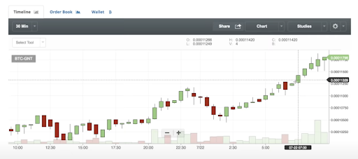

## Subject facet

The subject domain is the educational industry of teaching students to understand blockchain technology. Dr. Chen is a professor in the Computer Science department who focuses on Artificial Intelligence such as data mining in database keyword search, study of database management systems and big data analysis from his personal profile list on the UNO website. 

Thus, he wants to have a simulation web application for blockchain technology so that students, particularly computer science major students, can have hands-on experience to increase their interests of learning new technologies and exploring fundamentals of blockchain technology. In this way, he can improve his teaching field through involving modern technology to his course.

## Usage facet: 
 
In recent years, Blockchain technology is growing very fast and there are tons of introduction videos about Blockchain but there is no clear guideline application for amateurs to learn from this new technology. We want to have a simulator application for users to have hands-on experience in our virtual application without spending real money at high risk to try blockchain-related systems on the internet.   

  

[Intro to blockchain Youtube Video](https://www.youtube.com/watch?v=SSo_EIwHSd4)  

This application will be used for educational purposes to help students understand the basic structure of blockchain and why it can be considered as decentralized systems from the Animation page. More specifically, the web application should offer several efficient functions of query and storing information that include user’s data and blocked data from the Block Explorer Page. And users can imitate the cryptocurrency transaction and view the buy/sell history chart through the Trade Cryptocurrency Page.   

  

[Buy and Sell process](https://www.coinbase.com/ )

  

[Block Explorer for Bitcoin](https://blockstream.info/)  

  

[History of Transaction Chart](https://bittrex.com/)  

The stakeholders for the applications are the IS&T institutions, computer science students who are interested in blockchain technology, and professors who are willing to construct and innovate newest knowledge that are related to databases and cryptocurrency. 
 
## IT facet: 

The **web simulation application** should have following functionalities/services:
Animation Page to show how blocks can form a chain and list features, properties, and data structures of blockchain technology through different examples in real life. 

[_Related-Video_](https://www.youtube.com/watch?v=SSo_EIwHSd4 )

**Block Explorer Page** displays the contents of individual digital blocks transactions, the transaction histories, and balances of users’ accounts with several efficient functions. Moreover, to achieve the goal of using database structure to access block data, block hash, block height, and transactions into databases, our program will use tables to query and store blocks’ elements.

_Related-Website:_
  1. [Blockstream](https://blockstream.info/)
  2. [Blockchain](https://www.blockchain.com/explorer)
  3. [Bitcoin](https://btc.com/)
  4. [Sql Template](http://blockchainsql.io/Query/Template/10)
  5. [Abe-Bitcoin](https://github.com/bitcoin-abe/bitcoin-abe )
[Related-Video:](https://www.youtube.com/watch?v=laeV2slJgc8 )

**Trade Cryptocurrency** Page for users imitate buying and selling cryptocurrency through a few steps: input virtual payment method, enter amount, sell/buy option, and digital recipient etc. Additionally, to maintain the stability of the system, transaction history with visual graphs and statistical charts will be available to both users’ and systems supervisors.

_Related-Website:_
[View market trend through charts](https://bittrex.com/)
[Buy and sell cryptocurrency](https://www.coinbase.com/)

[_Related-Video_](https://www.youtube.com/watch?v=M-qYym-i1_8 )

