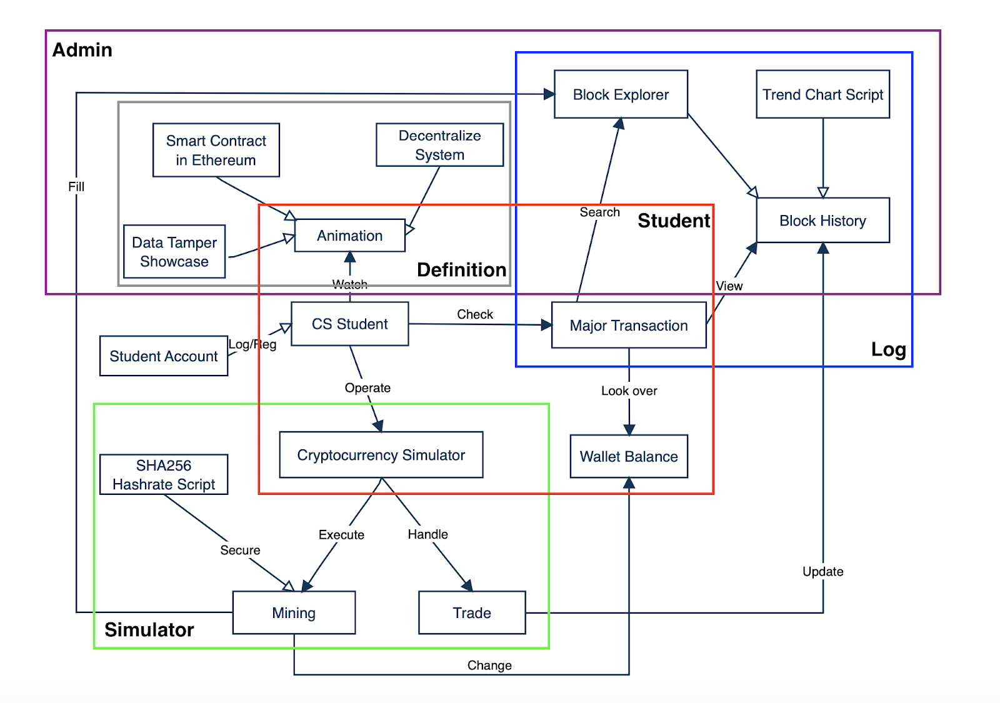
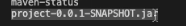

# EduBlockchain
  The EduBlockchain is a web application of blockchain which could assist the future blockchain related curriculum.
  
  
## Introduction
 
In recent years, Blockchain technology is growing very fast and there is tons of complex information about Blockchain but there is no clear guideline application for amateurs to learn from this new technology. According to Professor Chen’s requirement, our team needs to build a web based simulation which relates to blockchain technology. 

This application has been used for educational purposes to help students understand the basic structure of blockchain and why it can be considered as decentralized systems.More specifically, the web application should offer several efficient functions of query and storing information that include user’s data and blocked data. 

Developing such web applications and having hands-on practice in such an environment should stimulate students’ interests of learning and exploring fundamentals of blockchain technology, especially for future CS undergrad students who are interested in blockchain-related studies. 


## Basic architecture

Description:
1. **Definition:**   
   A simple visual interpretation of what core technologies exist inside of blockchain in the operational environment. It contains the Animation section which consists of three    root theories of the blockchain system to give basic understanding of the blockchain like what is the decentralized systems; how a mis-use case can tamper system integrity;    why do we need smart contracts. 
2. **Student:**   
   The main executor in the application environment. The users can get access to the application through creating a new student account in the system. Also, users can initiate    Cryptocurrency Simulator to get familiar with blockchain technology ,check Major Transactions to review all transactions’ details and explore Animations to further              understand blockchain definitions.  
3. **Simulator:**  
   A users’ interface to provide concrete operational methods on blockchain implementation. It lets users go through the block structure in a proper way, and it also offers a      mining platform, which uses SHA256 cryptography algorithm to compute the hashrate of current block header, to support users to get experience on the real world mining work.    Furthermore, handling the blockchain transactions in a more technical view through the Trade interface. 
4. **Log:**   
   A middleware to support both Admin’s and Student’s functionalities. Log diagram strictly separates the accessibility of students and administrators. Students’ accounts only    have a read privilege to the system information, but administrators have more privilege (not including the remove and add privilege) of the system log like verify and revise    the users’ transactions at a specific moment. (In this case, we haven’t applied the full function of decentralized system because the users might be intentionally or            inadvertently to compromise the system log, but we specify a time period to constrain modifications on blockchain) 
5. **Admin:**  
   The main function of manipulating the system environment. It can handle multiple threads simultaneously. The Admin has authority to CRUD (create, read, update, delete) these    functions mainly for Animation function and Transaction function. Additionally, they can verify and revise scripts or databases related to corresponding functions such as      Trend Chart Script for user history framework and data tamper showcase for explaining potential drawbacks to cryptocurrency using blockchain. 
   
## Usage

 <!--**Prerequirement:**  
 * Step 1: Connect to your UNO vpn through DUO-factor authentication.
 * Step 2: Open any favorite browser and type the URL.
 * Step 3: Using the URL (unomahablockchain.ddns.net) to access the project web application
 * Step 4: Waitting the server response for a while  
 * Step 5: If the server doesn't response or the webpage shows the error message, please inform the system admin to start the server. (In current stage, server is closed)-->
 **Installation**
   1. Install Node.js with NPM as the below url. 
      [How to intall Node.js and NPM](https://phoenixnap.com/kb/install-node-js-npm-on-windows)
   2. After the download and configuration, verifying Node.js version and Npm status to make sure both have been installed correctly. (The verify command is also listed in           above URL
   3. Download the Zipped code by using the **Code** button in the right corner and unzip it
      
   4. Or Using the git clone command: 
      ```
      git clone https://github.com/fire-holder/EduBlockchain.git
      ```
   5. After you get the Edublockchain folder, open the folder inside of Visual Studio to compile and generate a new executable.jar file and store it in your /Desktop. For             example you can run beneath command to generate .jar in Visual Studio's terminal
      ``` 
      cd YOUR_PROJECT_DIRECTORY // locate the project directory
      mvn package // Using Maven to generate .jar file
      cd target // Direct to the /target folder, the .jar file will be there. 
      ```
      The .jar file ought to look like:  
        
      
   6. Open Powershell and direct to the the .jar file location, then run the following command (Make sure your JDK and JRE have the most recent version like version 11).
      ```
      java -jar YOUR_EXECUTABLE_FILE_NAME.jar
      ``` 
   7. Then you can open a web browser (e.g. Google Chrome) and type the following command in the URL box
       ```
       http://localhost:8080
       ```
       
 **On the Web Applications:**
   1. _Home Page_: Start page  
        
   2. _Login page_: By using user's registered credential  
        
   3. _Register page_ : Double check password    
        
   4. _Hashrate Exploration page_: Generating hashcode based on user's input  
        
   5. _Blocks Components page_: Multiple functions can be executed in this page  
      * Overview of block structure  
          
      * How does the block head looks like in every block  
          
      * How to initiate a transaction between different users  
          
   6. _Payment_: More concrete transaction simulator  
        
   

## License
MIT  
JQuery  
Pug  
JSON  
SpringBoot  


## Release Update - October 4, 2020
1. **Spring Boot:**  
   webController: postmapping and getmapping.   
   UserRepository: insert/select user info to database.  
   createTransactionRepository: insert transaction info to database.  
   UserForm: Entity for user variables of username, password, and wallet.  
   createTransactionForm: Entity for transaction variabel of sender_addr, receiver_addr, amount, hashid.  
   Application Properties: directories for data source, JPA, and thymeleaf.  
2. **CSS + JS + HTML5:**  
   Home/User: Bootstrap, web interface.  
   Sign/Register: user authentication.  
   SHA256: hash rate function to encrypt data.  
   Block: Jquery.js, show what is a block looks like in the Bitcoin World.  
   Transaction: Payment prototype.  
3. **Test + Documentation:**  
   Home, Sign, Register, User, ProjectApplication, Application Properties;     
   webController, UserRepository, createTransactionRepository;  
   UserForm, createTransactionForm;  
   SHA256, Block, Transaction.  
   
   
